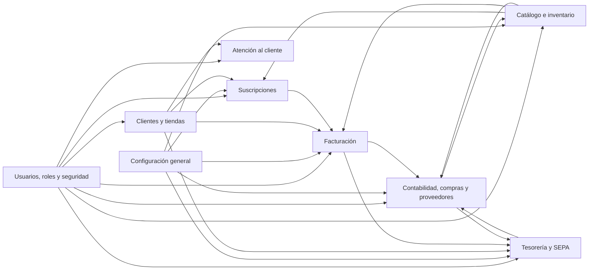
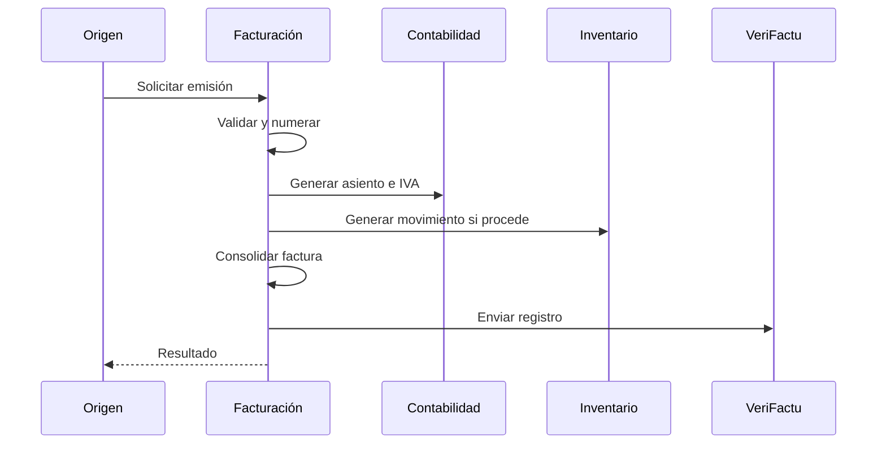
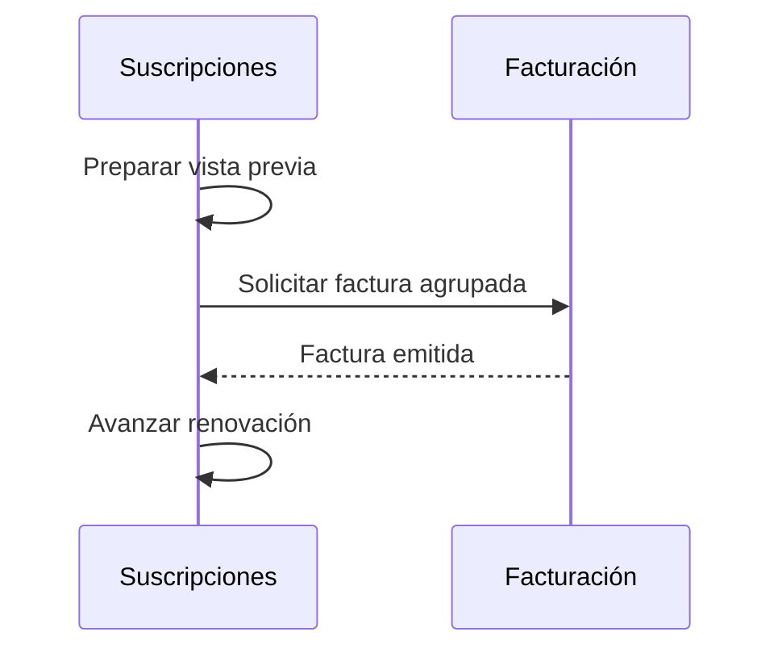
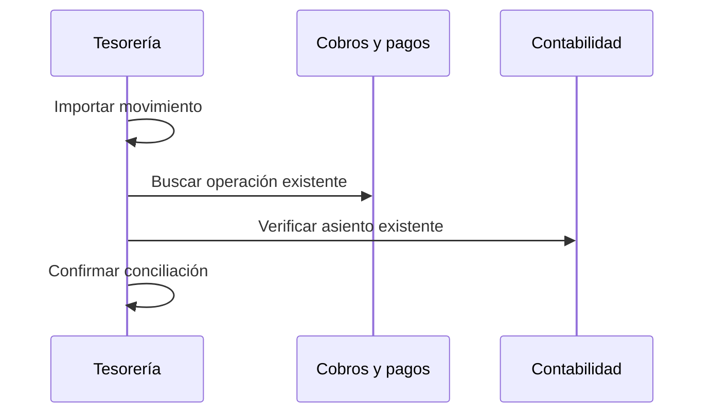

# Mapa funcional de módulos

## 1. Objetivo

Este documento delimita responsabilidades y dependencias para evitar:

- Duplicación de datos.
- Lógica repetida.
- Dependencias circulares.
- Operaciones económicas inconsistentes.

## 2. Vista general

Las flechas indican consumo funcional, no acceso directo obligatorio a tablas.

## 3. Capas funcionales

### Transversales

- Seguridad.
- Configuración.
- Auditoría.
- Notificaciones.
- Adjuntos.

### Maestros

- Clientes y tiendas.
- Catálogo.
- Proveedores.
- Plan contable.

### Operacionales

- Suscripciones.
- Facturación.
- Atención al cliente.
- Compras y gastos.
- Cobros y pagos.

### Control

- Contabilidad.
- Tesorería.
- Inventario.
- Informes.

## 4. Propiedad de datos

| Dato | Módulo propietario | Consumidores principales |
|---|---|---|
| Empresa | Configuración | Todos |
| Usuarios y roles | Seguridad | Todos |
| Auditoría | Seguridad transversal | Todos |
| Clientes | Clientes | Suscripciones, Facturación, Incidencias, Tesorería, Contabilidad |
| Tiendas | Clientes | Incidencias |
| Mandatos de cliente | Clientes | Tesorería, Facturación |
| Productos y servicios | Catálogo | Facturación, Suscripciones, Compras |
| Stock y movimientos | Catálogo | Facturación, Compras |
| Suscripciones | Suscripciones | Clientes, Facturación, Previsiones |
| Facturas de venta | Facturación | Clientes, Contabilidad, Tesorería |
| Presupuestos | Facturación | Clientes |
| Vencimientos de cliente | Facturación | Tesorería, Contabilidad |
| Cobros y anticipos | Facturación | Tesorería, Contabilidad, Clientes |
| Incidencias y comunicaciones | Atención al cliente | Clientes |
| Proveedores | Contabilidad y Compras | Tesorería |
| Facturas de compra | Contabilidad y Compras | Tesorería, Catálogo |
| Vencimientos de proveedor | Contabilidad y Compras | Tesorería |
| Asientos | Contabilidad | Informes, Tesorería |
| Plan contable | Contabilidad | Catálogo, Facturación, Configuración |
| Remesas | Tesorería | Facturación, Contabilidad |
| Extractos y conciliaciones | Tesorería | Contabilidad |
| Impuestos | Configuración | Facturación, Suscripciones, Compras |
| Certificado VeriFactu | Configuración | Facturación mediante adaptador server-side |
| Plantillas y numeraciones | Configuración | Módulos correspondientes |

## 5. Responsabilidades por módulo

### Seguridad

Es propietario de:

- Usuarios.
- Roles.
- Permisos.
- Sesiones.
- Auditoría central.
- Alertas de seguridad.

No contiene reglas económicas.

### Configuración

Es propietario de:

- Empresa.
- Cuenta bancaria común.
- Ejercicios como configuración.
- Impuestos.
- Certificado.
- Custodia server-side cifrada del certificado VeriFactu.
- SMTP.
- Plantillas.
- Contadores.

No emite facturas ni ejecuta cierres.

### Clientes

Es propietario de:

- Identidad del cliente.
- Datos fiscales maestros.
- Direcciones.
- Tiendas y contactos.
- Condiciones de pago.
- IBAN y mandato.

No calcula saldos ni mantiene copias de facturas.

### Catálogo

Es propietario de:

- Categorías.
- Productos y servicios.
- Precios y costes.
- Cuentas propuestas.
- Stock.
- Movimientos de inventario.

No determina la fiscalidad final de una factura.

### Suscripciones

Es propietario de:

- Contrato periódico.
- Planes.
- Conceptos contratados.
- Calendario.
- Cambios programados.
- Renovaciones pendientes.

No emite facturas directamente ni registra cobros.

### Facturación

Es propietario de:

- Presupuestos.
- Facturas de venta.
- Rectificativas.
- Anticipos de clientes.
- Vencimientos.
- Cobros.
- PDF y correo.
- Registros VeriFactu.

Es el único motor de facturas de venta.

### Atención al Cliente

Es propietario de:

- Comunicaciones.
- Incidencias.
- Actuaciones.
- Colaboradores.
- Historial operativo de soporte.

No duplica clientes, suscripciones ni facturas.

### Contabilidad y Compras

Es propietario de:

- Plan contable.
- Asientos.
- Proveedores.
- Compras.
- Gastos.
- Pagos.
- Registros de IVA.
- Informes y cierres.

No emite facturas de venta.

### Tesorería

Es propietario de:

- Remesas.
- Devoluciones bancarias.
- Extractos.
- Conciliaciones.
- Previsiones.

No crea automáticamente cobros, pagos ni asientos desde la conciliación.

## 6. Dependencias permitidas

| Módulo | Puede depender de |
|---|---|
| Seguridad | Configuración técnica mínima |
| Configuración | Seguridad |
| Clientes | Seguridad, Configuración |
| Catálogo | Seguridad, Configuración, Contabilidad para cuentas |
| Suscripciones | Seguridad, Configuración, Clientes, Catálogo, Facturación mediante contrato |
| Facturación | Seguridad, Configuración, Clientes, Catálogo, Contabilidad mediante contrato |
| Atención al Cliente | Seguridad, Clientes |
| Contabilidad y Compras | Seguridad, Configuración, Clientes, Catálogo, Facturación mediante eventos o contratos |
| Tesorería | Seguridad, Configuración, Clientes, Facturación, Contabilidad |

## 7. Dependencias que deben evitarse

- Clientes no depende internamente de Facturación para guardar su maestro.
- Catálogo no depende de Facturación para existir.
- Suscripciones no escribe directamente en tablas de Facturación.
- Facturación no modifica directamente una suscripción.
- Contabilidad no modifica directamente una factura emitida.
- Tesorería no crea asientos desde una conciliación.
- Atención al Cliente no expone datos económicos a técnicos.
- Configuración no ejecuta operaciones de negocio.

Las vistas agregadas pueden consultar varios módulos mediante servicios de lectura.

## 8. Contratos principales

### Solicitud de factura

Productores:

- Usuario manual.
- Suscripciones.
- Presupuestos.
- Anticipos.

Consumidor:

- Facturación.

Resultado:

- Factura emitida o error completo.

### Factura emitida

Consumidores:

- Contabilidad.
- Inventario, si contiene productos.
- Tesorería.
- Suscripciones, si procede.
- VeriFactu.

### Cobro registrado

Consumidores:

- Facturación.
- Contabilidad.
- Tesorería.

### Compra registrada

Consumidores:

- Contabilidad.
- Inventario.
- Tesorería.

### Cliente inactivado

Consumidores:

- Suscripciones, para cancelación.
- Facturación, para bloquear nuevos documentos.
- Tesorería, para cancelar operaciones futuras no enviadas.
- Atención al Cliente, que mantiene soporte permitido.

## 9. Procesos críticos

### Emisión

El envío externo puede quedar pendiente sin deshacer una emisión ya consolidada.

### Renovación

Si Facturación devuelve error, no avanza la renovación.

### Conciliación

## 10. Lecturas agregadas

La ficha unificada del cliente puede mostrar:

- Datos maestros desde Clientes.
- Suscripciones desde Suscripciones.
- Facturas y cobros desde Facturación.
- Incidencias desde Atención al Cliente.
- Riesgo y saldos desde Facturación.

La pantalla no debe duplicar ni permitir editar información fuera del módulo propietario.

## 11. Datos históricos

Los documentos emitidos conservan instantáneas.

Ejemplos:

- Datos fiscales de una factura.
- Precio y descripción de una línea.
- Cuenta contable aplicada.
- Tipo de impuesto.
- Datos del mandato utilizados en una remesa.

Los maestros pueden cambiar sin alterar documentos históricos.

## 12. Reglas de integración

1. Cada entidad tiene un único propietario.
2. Los demás módulos usan identificadores estables.
3. Las operaciones entre módulos son idempotentes.
4. Los errores no dejan estados parciales.
5. Los documentos históricos usan instantáneas.
6. Las acciones remotas quedan auditadas en origen y destino.
7. Los permisos se validan antes de cruzar información.
8. Los procesos externos admiten reintento controlado.
9. Las vistas agregadas son de lectura salvo navegación al propietario.
10. Los cambios de contrato requieren actualizar la documentación transversal.

## 13. Módulos técnicos pendientes

Deberán diseñarse transversalmente:

- Copias de seguridad.
- Almacenamiento de adjuntos.
- Notificaciones.
- Correo saliente.
- Integración VeriFactu.
- Generación documental.
- Importación de Norma 43.
- Monitorización.
- Procesamiento de tareas.

## 14. Próximos documentos

Después de validar este mapa deben elaborarse:

1. Casos de uso por módulo.
2. Reglas de negocio normalizadas.
3. Modelo de dominio.
4. Arquitectura técnica.
