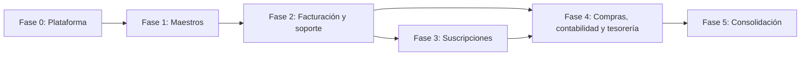

# Alcance y fases del MVP

## 1. Objetivo

El MVP debe permitir operar diariamente con clientes, suscripciones, facturación, soporte, compras y control económico sin duplicar datos ni comprometer la trazabilidad.

No se intentará entregar todos los informes, automatizaciones e integraciones avanzadas en una única versión.

## 2. Criterio de priorización

Una funcionalidad entra antes cuando:

- Es necesaria para que otro módulo funcione.
- Sustituye un proceso diario manual.
- Afecta a facturación o cumplimiento.
- Reduce errores económicos.
- Permite validar pronto el modelo de datos.

Se pospone cuando:

- Es principalmente analítica.
- Depende de volumen histórico.
- Requiere integración externa no esencial.
- Puede realizarse temporalmente con un proceso manual controlado.

## 3. Definición del MVP

El MVP funcional completo comprenderá las fases 0 a 4.

Cada fase debe ser:

- Utilizable.
- Migrable a la siguiente.
- Probada.
- Auditada.
- Compatible con los propietarios de datos definidos.

VeriFactu será obligatorio antes de utilizar Facturación en producción cuando resulte legalmente exigible. No se considerará una mejora opcional.

## 4. Fase 0: Base de plataforma

### Objetivo

Disponer de una aplicación segura, configurable y preparada para alojar los módulos.

### Incluido

- Datos de la empresa.
- Cuenta bancaria común.
- Ejercicio abierto.
- Impuestos básicos.
- Numeraciones.
- Usuarios.
- Roles base.
- Permisos por módulo.
- Inicio y cierre de sesión.
- Auditoría central.
- Notificaciones internas.
- Repositorio seguro de adjuntos.
- Configuración SMTP básica.
- Gestión de errores y registros técnicos.
- Copia de seguridad manual completa.

### Criterio de salida

- Un administrador puede configurar la empresa.
- Los cuatro roles base acceden únicamente a sus áreas.
- Toda operación de prueba queda auditada.
- Se puede realizar y verificar una copia de seguridad.

## 5. Fase 1: Maestros operativos

### Objetivo

Crear la base de datos empresarial compartida.

### Incluido

#### Clientes

- Alta, edición, activación e inactivación.
- NIF y VAT.
- Direcciones.
- Tiendas.
- Contactos.
- Condiciones de pago.
- IBAN y mandato.
- Búsqueda y duplicados.

#### Catálogo

- Categorías.
- Productos, servicios, software y licencias.
- Precio, coste y cuentas.
- Estado activo o inactivo.
- Stock inicial.
- Entradas manuales.
- Stock mínimo.

#### Contabilidad base

- Plan contable precargado.
- Subcuentas.
- Creación automática de cuenta de cliente.
- Configuración de cuentas predeterminadas.

### Pospuesto

- Fusión de clientes.
- Paneles avanzados.
- Valoración histórica compleja.
- Proveedores y compras.

### Criterio de salida

- Puede crearse un cliente completo.
- Puede seleccionarse un concepto del catálogo.
- El sistema dispone de las cuentas necesarias para facturar.
- Los roles ven únicamente los datos permitidos.

## 6. Fase 2: Facturación y atención al cliente

### Objetivo

Permitir vender, cobrar y atender a clientes.

### Incluido

#### Facturación

- Presupuestos básicos.
- Conversión total a factura.
- Factura manual.
- Motor único de emisión.
- Series y numeración.
- Impuestos y redondeo.
- Vencimientos.
- PDF.
- Correo.
- Asiento automático de venta.
- Registro de IVA repercutido.
- Salida de stock.
- Cobros manuales.
- Factura rectificativa íntegra.
- Inmutabilidad e instantánea fiscal.

#### Atención al cliente

- Comunicaciones manuales.
- Incidencias.
- Responsable y colaboradores.
- Estados, prioridades y categorías.
- Actuaciones.
- Adjuntos.
- Búsqueda.
- Notificaciones.

### Condición normativa

Antes de utilizar esta fase en producción se completarán:

- Registros de facturación.
- Encadenamiento y hash.
- QR y leyendas aplicables.
- Comunicación VeriFactu.
- Declaración responsable.
- Validación fiscal final.

### Pospuesto

- Conversión parcial de presupuestos.
- Anticipos.
- Cobros aplicados a varias facturas.
- Devoluciones bancarias.
- Fusión de incidencias.
- Indicadores avanzados.
- Envío automático de WhatsApp.

### Criterio de salida

- Puede emitirse una factura completa sin estados parciales.
- La factura genera asiento, IVA y stock.
- Puede registrarse su cobro.
- Puede rectificarse sin modificar el original.
- Puede registrarse y resolver una incidencia.

## 7. Fase 3: Suscripciones

### Objetivo

Automatizar la facturación periódica sobre el motor ya validado.

### Incluido

- Planes.
- Suscripciones.
- Modalidad fija o por licencias.
- Periodicidades.
- Conceptos.
- Cambios programados.
- Cancelación y reactivación.
- Vista previa mensual.
- Agrupación por cliente y forma de pago.
- Exclusiones y pendientes.
- Idempotencia por periodo.
- Facturación mediante el motor común.
- Avance de renovación tras emisión correcta.
- Previsión de suscripciones.

### Pospuesto

- Cambios masivos.
- Automatización desatendida.
- Reglas complejas de descuentos y recargos.
- Paneles analíticos avanzados.

### Criterio de salida

- Una renovación no puede facturarse dos veces.
- Una factura agrupada mantiene sus líneas y periodos.
- Un fallo no avanza ninguna renovación afectada.
- Una factura de suscripción es indistinguible funcionalmente de una factura manual salvo por su origen.

## 8. Fase 4: Compras, contabilidad y tesorería

### Objetivo

Completar el ciclo económico y ofrecer control contable y bancario.

### Incluido

#### Proveedores y compras

- Proveedores.
- Facturas de compra.
- Adjuntos.
- Control de duplicados.
- IVA soportado.
- Asiento automático.
- Entradas de stock.
- Vencimientos.
- Pagos.
- Gastos sin factura.

#### Contabilidad

- Asientos manuales.
- Plantillas.
- Diario.
- Mayor.
- Balance de sumas y saldos.
- Registro de IVA.
- Pérdidas y ganancias.
- Balance de situación.
- Ejercicio y cierre.

#### Tesorería

- Remesas SEPA CORE.
- XML.
- Procesamiento manual.
- Devoluciones.
- Norma 43.
- Conciliación manual.
- Previsión mensual y anual.

### Pospuesto

- Renumeración de asientos.
- Comparativas avanzadas.
- Gastos periódicos convertibles.
- Conciliación con propuestas sofisticadas.
- Informes personalizados.

### Criterio de salida

- Una compra genera asiento, IVA y stock.
- Un pago actualiza vencimiento y contabilidad.
- Una remesa registra cobros correctamente.
- Los movimientos pueden conciliarse sin crear operaciones duplicadas.
- El ejercicio puede cerrarse y abrir el siguiente.

## 9. Fase 5: Consolidación posterior al MVP

No forma parte del MVP mínimo.

### Funciones candidatas

- Fusión de clientes y proveedores.
- Anticipos completos.
- Conversión parcial de presupuestos.
- Cobros y pagos muchos a muchos.
- Renumeración de asientos.
- Paneles e indicadores avanzados.
- Informes comparativos.
- Automatizaciones de avisos.
- Gestión avanzada de devoluciones.
- Mejoras de previsión.
- Exportaciones avanzadas.
- Copias de seguridad programadas y pruebas automáticas de restauración.

## 10. Futuro

- Portal del cliente.
- WhatsApp integrado.
- Aplicación móvil.
- Factura electrónica B2B.
- Multiempresa.
- Multimoneda.
- Varios almacenes.
- Inmovilizado.
- Conciliación asistida avanzada.
- Inteligencia artificial.

## 11. Dependencias entre fases

## 12. Entregas recomendadas

| Entrega | Contenido principal | Valor operativo |
|---|---|---|
| E0 | Plataforma y seguridad | Entorno estable y auditable |
| E1 | Clientes, catálogo y cuentas | Maestros listos |
| E2 | Facturación manual y soporte | Ventas y atención diaria |
| E3 | Suscripciones | Renovación periódica |
| E4 | Compras, contabilidad y tesorería | Ciclo económico completo |
| E5 | Consolidación | Eficiencia y analítica |

## 13. Exclusiones del MVP completo

- Multiempresa.
- Multimoneda.
- Multidioma.
- Aplicación móvil.
- Portal externo.
- Integración automática con WhatsApp.
- Múltiples almacenes.
- Inmovilizado.
- Nóminas.
- Producción.
- Comercio electrónico.
- Firma digital del PDF.
- Creación automática de operaciones desde conciliación.

## 14. Riesgos de planificación

### Cumplimiento

VeriFactu, fiscalidad, SEPA y protección de datos pueden cambiar requisitos y deben validarse antes de cerrar cada entrega afectada.

### Alcance

Facturación, Contabilidad y Tesorería contienen más complejidad que un CRUD. No deben implementarse simultáneamente sin contratos y pruebas.

### Integridad

Las operaciones transversales exigen transacciones, idempotencia y recuperación ante fallos.

### Datos

La migración desde sistemas anteriores puede condicionar códigos, saldos, numeraciones y documentos históricos.

## 15. Condiciones generales de finalización

Una fase se considera terminada cuando:

1. Sus casos de uso están documentados.
2. Sus reglas están implementadas.
3. Los permisos se validan en servidor.
4. La auditoría está activa.
5. Las pruebas funcionales pasan.
6. No deja estados parciales.
7. Los errores son recuperables.
8. La documentación está actualizada.
9. La copia de seguridad cubre sus datos.
10. El usuario responsable acepta la fase.

## 16. Próxima actividad

Antes de desarrollar deberán elaborarse, empezando por la Fase 0 y la Fase 1:

- Casos de uso.
- Reglas de negocio numeradas.
- Criterios de aceptación detallados.
- Modelo de dominio.
- Modelo de datos.
- Arquitectura técnica.

Los casos de uso de la Fase 0 están definidos en [Casos de uso de Plataforma](plataforma/02-casos-de-uso.md).

La arquitectura general está definida en [Arquitectura técnica](05-arquitectura-tecnica.md).
