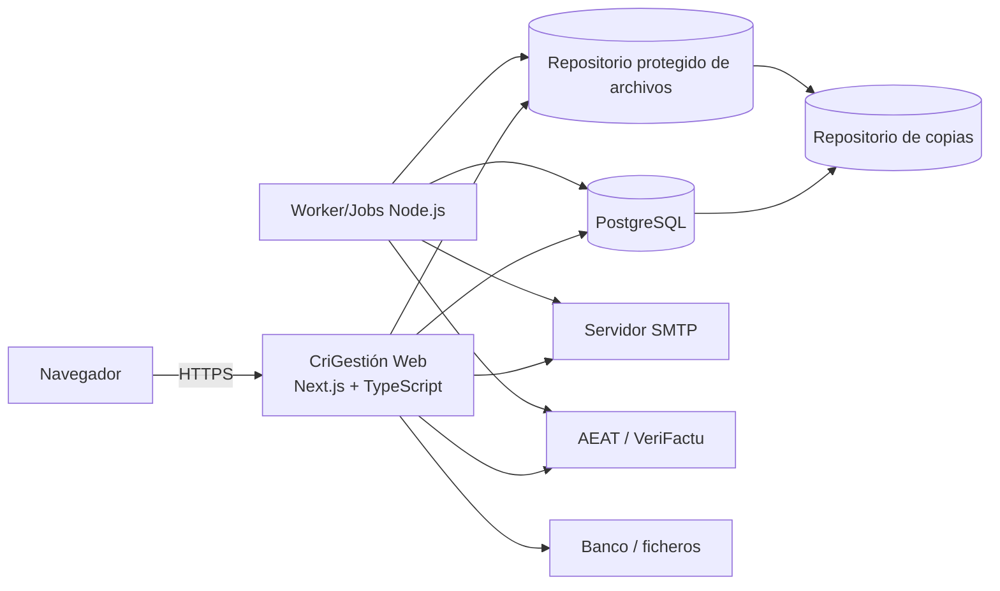

# Arquitectura tecnica general

## 1. Proposito

Este documento define la arquitectura tecnica vigente de CriGestión tras adaptar el proyecto a Next.js, TypeScript, PostgreSQL y Prisma.

La aplicacion pasa a ser web, con interfaz, API y casos de uso servidos desde una unica base Next.js. El despliegue inicial se mantiene como monolito modular para reducir complejidad operativa y conservar transacciones ACID en los flujos economicos.

## 2. Decisiones principales

| Area | Decision |
|---|---|
| Aplicacion | Next.js App Router |
| Lenguaje | TypeScript estricto |
| UI | React Server Components y Client Components solo cuando haya interaccion |
| API | Route Handlers de Next.js bajo `/api` |
| Arquitectura | Monolito modular por dominios funcionales |
| Base de datos | PostgreSQL |
| Acceso a datos | Prisma Client |
| Migraciones | Prisma Migrate |
| Validacion de entrada | Zod en bordes HTTP y formularios |
| Autenticacion | Sesion web con token opaco en cookie `HttpOnly`, hash de token en PostgreSQL y CSRF en mutaciones |
| Autorizacion | Permisos `Modulo.Accion` validados en servidor |
| Tiempo | Instantes en UTC; presentacion en `Europe/Madrid` |
| Adjuntos | Repositorio protegido fuera de la carpeta publica |
| Certificados VeriFactu | Custodia server-side cifrada; nunca en navegador ni PC de usuario |
| Eventos diferidos | Outbox transaccional en PostgreSQL |
| Procesos de fondo | Jobs Node.js dedicados o proveedor externo |
| Observabilidad | Logs estructurados, trazas y metricas |
| Pruebas | Unitarias, integracion, contrato y E2E web |

## 3. Vista general



## 4. Estilo arquitectonico

La primera version se implementa como monolito modular. Cada modulo conserva sus reglas, contratos, componentes y persistencia logica, pero se despliega dentro de la misma aplicacion Next.js.

Reglas:

- Las rutas y pantallas no contienen reglas de negocio complejas.
- Los casos de uso viven en `modules/<modulo>/application`.
- El acceso a Prisma se encapsula en `modules/<modulo>/infrastructure` o en consultas server-only.
- Los componentes cliente no importan Prisma, secretos ni modulos de infraestructura.
- Las operaciones economicas criticas usan transacciones de PostgreSQL mediante Prisma.

## 5. Aplicacion desplegable

### `CriGestión Web`

Responsabilidades:

- Interfaz web.
- Autenticacion y autorizacion.
- Route Handlers HTTP.
- Casos de uso.
- Persistencia mediante Prisma.
- Auditoria, Outbox e integraciones sincronas necesarias.

No debe:

- Exponer modelos internos de Prisma como contrato publico.
- Ejecutar reglas finales en el cliente.
- Guardar secretos en codigo versionado.
- Servir adjuntos desde `public/`.

### `CriGestión Jobs`

Proceso o servicio separado para tareas en segundo plano:

- Outbox.
- Reintentos SMTP y VeriFactu.
- Caducidad de sesiones.
- Retenciones y limpieza.
- Avisos periodicos.
- Copias de seguridad.
- Trabajos largos.

## 6. Estructura de codigo

```text
app/
  api/
  platform/
components/
lib/
modules/
  platform/
    application/
    domain/
    infrastructure/
    presentation/
prisma/
  schema.prisma
  migrations/
scripts/
tests/
docs/
```

La estructura concreta esta definida en [Estructura inicial de la solucion Next.js](06-estructura-solucion-dotnet.md).

## 7. Persistencia

PostgreSQL sera la base central.

Motivos:

- Transacciones ACID robustas.
- Indices parciales y expresivos.
- Tipos `uuid`, `jsonb`, `timestamptz` y restricciones avanzadas.
- Buen encaje con Prisma y despliegues web modernos.
- Coste operativo flexible.

Convenciones iniciales:

- Identificadores `uuid`.
- Instantes `timestamptz` en UTC.
- JSON funcional como `jsonb`.
- Tablas en `snake_case`.
- Restricciones e indices revisados en migraciones.
- `updatedAt` gestionado por Prisma donde aplique.

## 8. Prisma

Prisma se usa para:

- Modelo de datos versionado en `prisma/schema.prisma`.
- Cliente tipado.
- Migraciones con `prisma migrate`.
- Seed de catalogos tecnicos.

Reglas:

- No se importara Prisma en componentes cliente.
- No se devolveran entidades Prisma directamente como API estable.
- Las migraciones aplicadas no se editaran.
- Los cambios destructivos requeriran migracion por etapas.
- Las consultas criticas se revisaran con indices y, si hace falta, SQL parametrizado mediante Prisma.

## 9. API

La API publica se expone con Route Handlers bajo `/api`.

Convenciones:

- JSON UTF-8.
- Versionado funcional cuando el contrato lo requiera.
- Validacion con Zod.
- Errores con codigo funcional estable.
- `GET` para consultas.
- `POST` para altas y acciones.
- `PATCH` para cambios parciales controlados.
- No se usa borrado fisico para entidades que funcionalmente se conservan.

## 10. UI

La interfaz usa App Router:

- Server Components por defecto.
- Client Components solo para formularios, controles interactivos y estado de UI.
- Server Actions solo cuando mantengan contratos claros y no sustituyan APIs necesarias para integraciones.
- Formularios con validacion local orientativa y validacion final en servidor.

## 11. Seguridad

- HTTPS obligatorio en produccion.
- Secretos en variables de entorno o proveedor seguro.
- Cookies de sesion `HttpOnly`, `Secure` y `SameSite`.
- Tokens o sesiones siempre validados en servidor.
- Permisos revalidados en cada accion.
- Datos sensibles cifrados o protegidos con HMAC de busqueda cuando proceda.
- Logs sin contrasenas, tokens ni payloads sensibles completos.

## 12. Outbox y trabajos

Los eventos diferidos se guardan en PostgreSQL dentro de la misma transaccion que el cambio funcional.

El procesador:

1. Reserva mensajes pendientes con bloqueo.
2. Ejecuta el manejador idempotente.
3. Registra intentos.
4. Marca procesado o programa reintento.
5. Envia a error tras superar limites.

## 13. Adjuntos

Los archivos se guardan fuera de `public/`.

Flujo:

1. Validar tamano y extension.
2. Guardar en cuarentena.
3. Detectar tipo real.
4. Calcular SHA-256.
5. Analizar con antivirus o adaptador equivalente.
6. Mover a almacenamiento definitivo.
7. Guardar metadatos en PostgreSQL.

Las descargas pasan por endpoint autorizado.

## 14. Certificados VeriFactu

Para CriGestión, al ser una aplicacion web, el certificado digital usado para remitir registros VeriFactu debe custodiarse en el lado servidor.

Decision tecnica:

- El certificado no dependera del navegador ni del equipo del usuario.
- La configuracion se asociara a la empresa obligada tributaria.
- El certificado se almacenara cifrado y fuera del repositorio.
- La contrasena o clave de descifrado se guardara en un proveedor seguro de secretos.
- El uso del certificado quedara auditado por intento de envio.
- Los jobs server-side podran usarlo para reintentos y envios diferidos.
- Un certificado caducado, revocado o no probado bloqueara los envios VeriFactu.

Si CriGestión actuase como tercero que remite registros en nombre del obligado tributario, debera existir representacion o colaboracion social valida antes de habilitar la remision.

Solo tendria sentido usar el certificado en el equipo del cliente en una variante local pura, instalada y operada por el propio obligado tributario. Esa no es la arquitectura vigente.

## 15. Despliegue

Entornos:

- Desarrollo local.
- Pruebas.
- Produccion.

Cada entorno tiene `DATABASE_URL`, secretos, repositorio de archivos y configuracion de integraciones propios.

La aplicacion puede desplegarse en un host Node.js, contenedor o plataforma compatible con Next.js que permita conexiones PostgreSQL y procesos de migracion controlados.

## 16. Comandos iniciales

```powershell
npm install
npm run prisma:generate
npm run prisma:migrate
npm run dev
npm run typecheck
npm test
npm run test:e2e
npm run audit
npm run build
```

## 17. Criterios de aceptacion

1. La app Next.js compila con TypeScript estricto.
2. Prisma genera cliente sin errores.
3. Las migraciones crean una base PostgreSQL desde cero.
4. Ningun componente cliente importa Prisma.
5. La API valida entrada con Zod.
6. Los secretos quedan fuera del repositorio.
7. Las operaciones criticas usan transaccion.
8. La auditoria no contiene secretos.
9. Los adjuntos no se sirven desde carpeta publica.
10. Los certificados VeriFactu se custodian server-side de forma cifrada.
11. La documentacion tecnica y ADRs apuntan al stack vigente.
