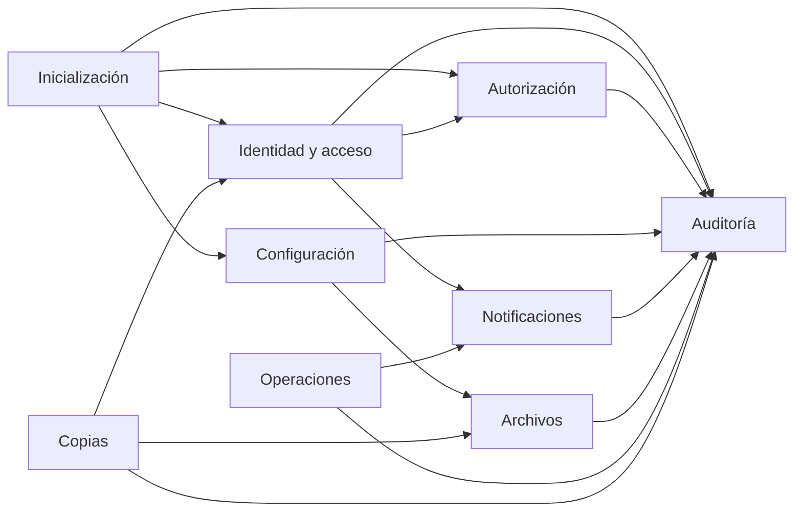
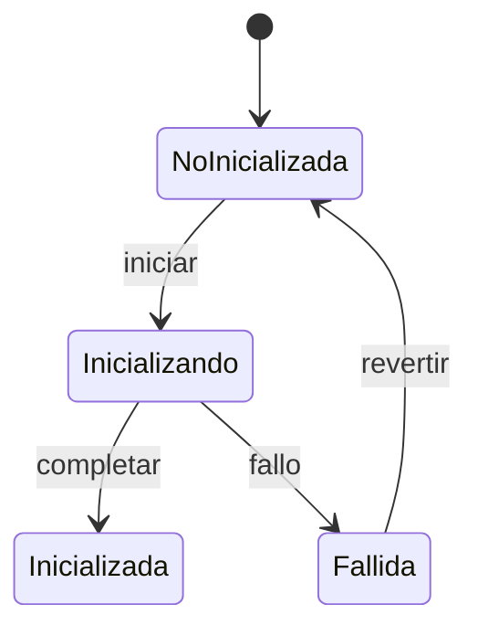
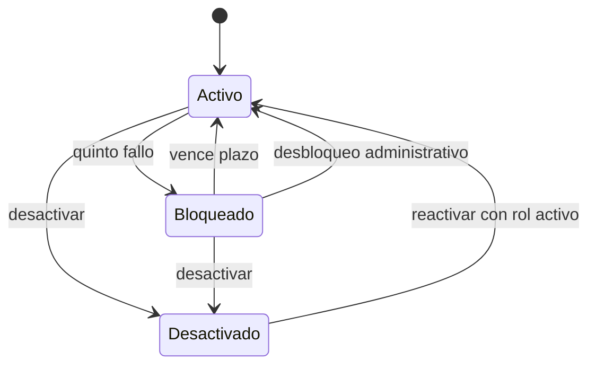
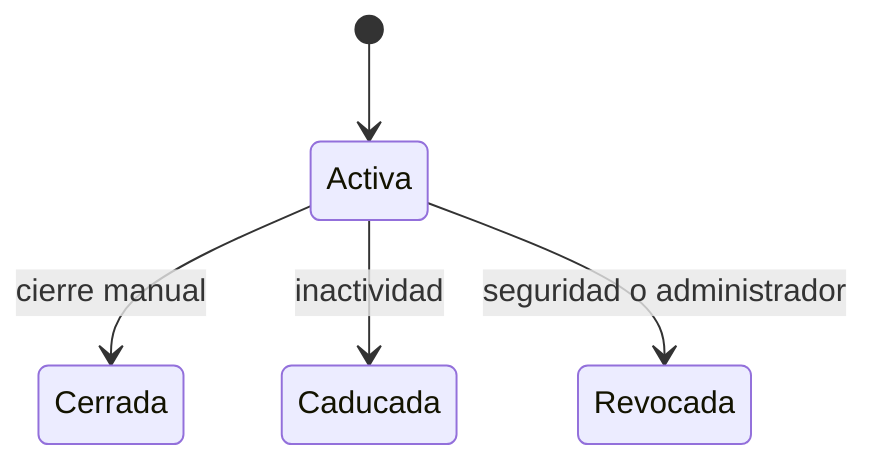
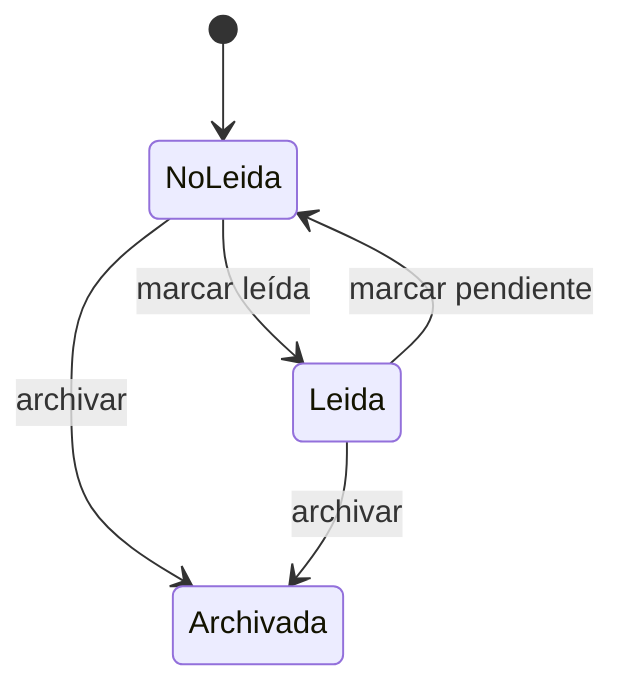
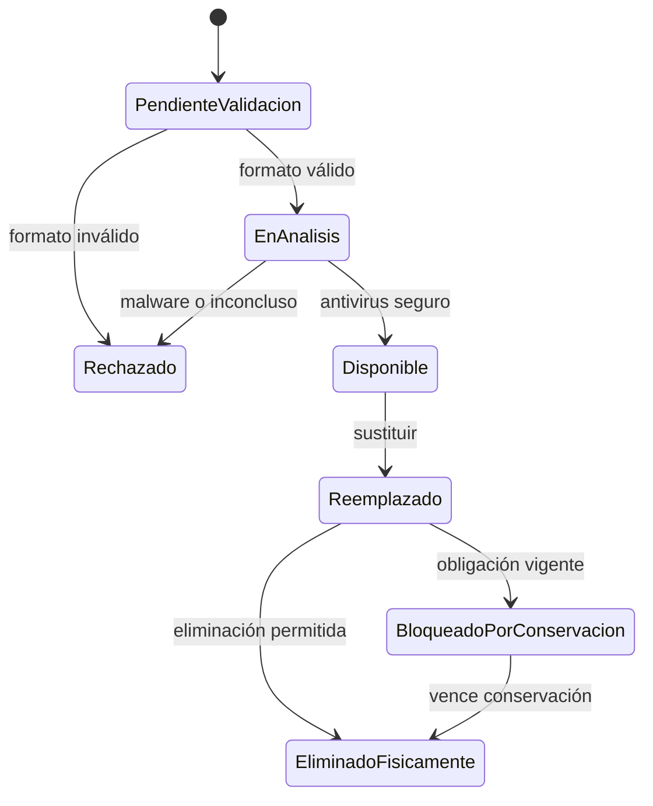
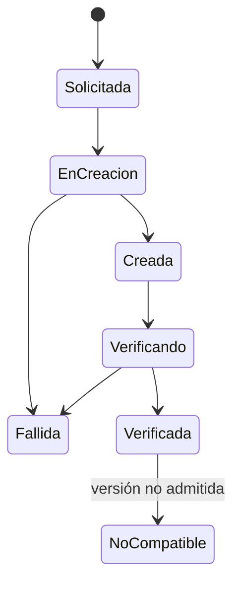
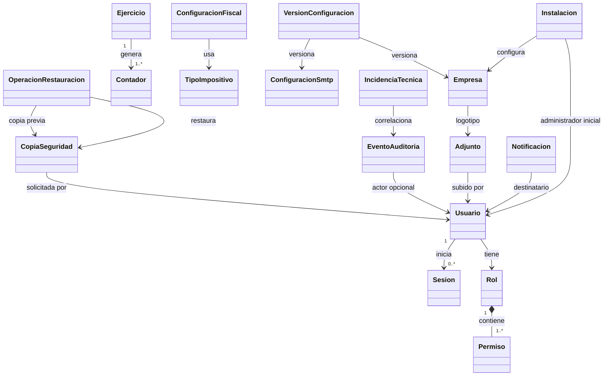

# Modelo de dominio: Fase 0 - Plataforma

## 1. Propósito

Este documento define el modelo conceptual de Plataforma antes de diseñar tablas, API o tecnología.

Describe:

- Contextos internos.
- Agregados.
- Entidades.
- Objetos de valor.
- Estados y transiciones.
- Invariantes.
- Servicios de dominio.
- Eventos.
- Límites transaccionales.
- Puertos hacia infraestructura.

## 2. Principios de modelado

### Separación de responsabilidades

Plataforma se divide en áreas con ciclos de vida independientes:

- Inicialización.
- Identidad y acceso.
- Autorización.
- Configuración.
- Auditoría.
- Notificaciones.
- Archivos.
- Operaciones técnicas.
- Copias de seguridad.

### Propiedad

Cada agregado es el único responsable de proteger sus invariantes.

### Referencias

Los agregados se relacionan mediante identificadores, no mediante grafos editables completos.

### Tiempo

- Las marcas temporales proceden de un reloj del sistema.
- Se almacenan en UTC.
- Las fechas puras no se convierten por zona horaria.

### Seguridad

- Las contraseñas nunca forman parte del modelo en texto.
- Los secretos se representan mediante referencias o valores protegidos.
- La autorización se evalúa fuera de la interfaz.

## 3. Contextos internos

## 4. Agregados principales

| Contexto | Agregado raíz | Responsabilidad |
|---|---|---|
| Inicialización | `Instalacion` | Garantizar una única inicialización coherente. |
| Identidad | `Usuario` | Estado, rol asignado, credencial y bloqueos. |
| Identidad | `Sesion` | Ciclo de vida de una sesión única. |
| Autorización | `Rol` | Conjunto válido de permisos. |
| Configuración | `Empresa` | Identidad y cuenta bancaria empresarial. |
| Configuración | `Ejercicio` | Periodo y contadores anuales asociados. |
| Configuración | `Contador` | Reserva transaccional y secuencial de números. |
| Configuración | `TipoImpositivo` | Porcentaje y vigencia fiscal. |
| Configuración | `ConfiguracionFiscal` | Retención y causas fiscales. |
| Configuración | `ConfiguracionSmtp` | Estado y datos protegidos de correo. |
| Configuración | `VersionConfiguracion` | Aplicación coherente de cambios tras reinicio. |
| Auditoría | `EventoAuditoria` | Registro inmutable de un hecho. |
| Notificaciones | `Notificacion` | Estado y destino de un aviso interno. |
| Archivos | `Adjunto` | Metadatos, estado de análisis y relación funcional. |
| Operaciones | `IncidenciaTecnica` | Diagnóstico y seguimiento de un error técnico. |
| Copias | `CopiaSeguridad` | Estado, integridad y compatibilidad de una copia. |
| Copias | `OperacionRestauracion` | Ejecución controlada de una restauración. |

## 5. Instalación

### Agregado `Instalacion`

Representa el estado de preparación global de una instancia de CriGestión.

#### Atributos

- `InstalacionId`.
- `Estado`.
- `IniciadaEnUtc`.
- `CompletadaEnUtc`.
- `AdministradorInicialId`.
- `VersionProducto`.

#### Estados

- `NoInicializada`.
- `Inicializando`.
- `Inicializada`.
- `Fallida`.

#### Transiciones

#### Invariantes

- Solo puede existir una instalación lógica.
- `Inicializada` exige un administrador activo.
- `Inicializada` exige los cuatro roles base.
- `Inicializada` exige la identidad `Sistema`.
- `Inicializada` exige configuración regional y contadores globales.
- Una instalación completada no puede reiniciarse.

#### Reglas relacionadas

`INI-RN-001` a `INI-RN-015`.

### Servicio `InicializadorPlataforma`

Coordina una transacción que crea:

- Roles base.
- Primer administrador.
- Usuario técnico `Sistema`.
- Empresa mínima.
- Configuración regional.
- Contadores globales.
- Auditoría.

El servicio no contiene detalles de persistencia.

## 6. Usuario

### Agregado `Usuario`

Es la raíz de identidad de un empleado.

#### Atributos

- `UsuarioId`.
- `NombreCompleto`.
- `NombreUsuario`.
- `Telefono`.
- `RolId`.
- `Estado`.
- `Credencial`.
- `IntentosFallidos`.
- `BloqueadoHastaUtc`.
- `CreadoEnUtc`.
- `DesactivadoEnUtc`.
- `UltimoAccesoUtc`.
- `UltimoCambioClaveUtc`.

#### Estados

- `Activo`.
- `Bloqueado`.
- `Desactivado`.

#### Transiciones

#### Comportamientos

- `RegistrarAccesoCorrecto`.
- `RegistrarAccesoFallido`.
- `BloquearTemporalmente`.
- `Desbloquear`.
- `CambiarRol`.
- `CambiarCredencial`.
- `Desactivar`.
- `Reactivar`.

#### Invariantes

- El nombre de usuario no cambia a otro ya utilizado.
- Siempre tiene un rol.
- Un usuario activo necesita un rol activo para acceder.
- Un usuario desactivado no se elimina.
- La credencial solo contiene un hash y sus parámetros.
- El quinto fallo activa un bloqueo de 30 minutos.
- Un intento durante el bloqueo extiende el bloqueo.

#### Reglas relacionadas

`SEG-RN-001` a `SEG-RN-045`.

### Objeto de valor `NombreUsuario`

- Normaliza el valor para comparar unicidad.
- Conserva la representación válida.
- No permite vacío.

La no reutilización histórica requiere un registro de nombres reservados o una restricción equivalente fuera del agregado.

### Objeto de valor `CredencialHash`

- Hash.
- Algoritmo.
- Parámetros.
- Versión.

Nunca contiene la contraseña original.

### Objeto de valor `PoliticaClave`

- Longitud mínima.
- Requiere mayúscula.
- Requiere minúscula.
- Requiere número.
- Requiere carácter especial.

La política inicial implementa `SEG-RN-018` a `SEG-RN-022`.

## 7. Sesión

### Agregado `Sesion`

Representa una autorización temporal.

#### Atributos

- `SesionId`.
- `UsuarioId`.
- `Estado`.
- `IniciadaEnUtc`.
- `UltimaActividadUtc`.
- `ExpiraPorInactividadEnUtc`.
- `Origen`.
- `Dispositivo`.
- `MotivoCierre`.
- `CerradaEnUtc`.
- `VersionCredencial`.

#### Estados

- `Activa`.
- `Cerrada`.
- `Caducada`.
- `Revocada`.

#### Transiciones

#### Invariantes

- Un usuario no puede tener más de una sesión activa.
- Una sesión no activa no puede renovarse.
- La actividad válida actualiza la última actividad.
- La sesión expira según la política vigente al crearla o renovarla.
- Cambiar contraseña, rol o estado del usuario revoca la sesión.

#### Reglas relacionadas

`SEG-RN-046` a `SEG-RN-059`.

### Servicio `GestorSesiones`

Responsable de:

- Comprobar sesión única.
- Crear sesiones.
- Renovar actividad.
- Caducar sesiones.
- Revocar una sesion remota por administracion.
- Revocar todas las sesiones de un usuario.

La garantía de sesión única se refuerza con una restricción de persistencia sobre sesiones no revocadas.

## 8. Rol y permisos

### Agregado `Rol`

#### Atributos

- `RolId`.
- `Nombre`.
- `Tipo`.
- `Estado`.
- Colección de `Permiso`.
- `CreadoEnUtc`.
- `ModificadoEnUtc`.

#### Tipo

- `Base`.
- `Personalizado`.

#### Estado

- `Activo`.
- `Inactivo`.

#### Comportamientos

- `CrearDesdeCopia`.
- `ConcederPermiso`.
- `RevocarPermiso`.
- `Desactivar`.
- `Reactivar`.

#### Invariantes

- El nombre es único.
- Un rol personalizado debe tener al menos un permiso.
- Un rol base no se modifica, desactiva ni elimina.
- `VerCostesYMargenes` solo pertenece al rol Administrador.
- Los permisos se asignan al rol, no al usuario.

#### Reglas relacionadas

`SEG-RN-060` a `SEG-RN-084`.

### Objeto de valor `Permiso`

Se identifica por:

- `Modulo`.
- `Accion`.

Ejemplos de acción:

- `Consultar`.
- `Crear`.
- `Modificar`.
- `Inactivar`.
- `Emitir`.
- `Contabilizar`.
- `Procesar`.
- `AdministrarConfiguracion`.
- `VerDatosEconomicos`.
- `VerCostesYMargenes`.

### Servicio `Autorizador`

Entrada:

- Usuario.
- Rol.
- Permiso requerido.
- Contexto funcional opcional.

Salida:

- Autorizado o denegado.
- Motivo técnico interno.

La autorización contextual de módulos futuros se aplica después de la autorización general.

## 9. Empresa

### Agregado `Empresa`

#### Atributos

- `EmpresaId`.
- `RazonSocial`.
- `NombreComercial`.
- `Nif`.
- `DireccionFiscal`.
- `Telefono`.
- `Correo`.
- `Web`.
- `RegistroMercantil`.
- `LogotipoAdjuntoId`.
- `CuentaBancaria`.
- `Idioma`.
- `Moneda`.
- `ZonaHoraria`.

#### Invariantes

- Solo existe una empresa.
- Solo existe una dirección fiscal.
- El NIF es válido.
- El NIF queda bloqueado después de la primera factura emitida.
- Solo existe una cuenta bancaria empresarial.
- El IBAN es válido.
- La moneda es euro en la primera versión.
- El idioma es español en la primera versión.

#### Reglas relacionadas

`CFG-RN-001` a `CFG-RN-014`.

### Objetos de valor

#### `Nif`

- Valor normalizado.
- Tipo detectado.
- Validación formal.

#### `DireccionPostal`

- Dirección.
- Código postal.
- Localidad.
- Provincia o región.
- País.

#### `CuentaBancaria`

- IBAN protegido.
- BIC opcional.
- Alias.

#### `ConfiguracionRegional`

- Idioma.
- Moneda.
- Zona horaria.

## 10. Ejercicio y contadores

### Agregado `Ejercicio`

#### Atributos

- `EjercicioId`.
- `Anio`.
- `FechaInicio`.
- `FechaFin`.
- `Estado`.
- Referencias a contadores anuales.

#### Estado inicial de Plataforma

- `Abierto`.
- `Cerrado`.

El cierre pertenece funcionalmente a Contabilidad.

#### Invariantes

- Las fechas son válidas y ordenadas.
- No existe solapamiento incompatible.
- Crear un ejercicio crea sus contadores anuales.

### Agregado `Contador`

#### Atributos

- `ContadorId`.
- `TipoDocumento`.
- `Ambito`.
- `EjercicioId` opcional.
- `Formato`.
- `UltimoValor`.
- `SiguienteValor`.
- `UltimaAsignacionUtc`.
- `VersionConcurrencia`.

#### Ámbitos

- `Global`.
- `Anual`.
- `PorCategoria`.

#### Comportamiento

- `ReservarSiguiente`.

#### Invariantes

- El formato es fijo.
- El siguiente valor no se edita manualmente.
- Consultar no reserva.
- Una reserva produce un valor único.
- Los contadores anuales pertenecen a un ejercicio.
- Los contadores globales no se reinician.

#### Reglas relacionadas

`CFG-RN-015` a `CFG-RN-027`.

### Servicio `AsignadorNumeracion`

Coordina la reserva atómica de un número y devuelve:

- Valor.
- Contador.
- Momento de asignación.

Debe manejar concurrencia sin duplicados.

## 11. Fiscalidad configurable

### Agregado `TipoImpositivo`

#### Atributos

- `TipoImpositivoId`.
- `Codigo`.
- `Nombre`.
- `Porcentaje`.
- `VigenteDesde`.
- `VigenteHasta`.
- `Estado`.
- `Usado`.

#### Invariantes

- Las vigencias de un mismo código no se solapan de forma incompatible.
- Un tipo usado no se modifica retroactivamente.
- Un tipo usado no se elimina.
- Cambiar porcentaje crea una nueva vigencia.

### Agregado `ConfiguracionFiscal`

Contiene:

- `PorcentajeRetencion`.
- Causas de exención.
- Causas de no sujeción.

### Entidad `CausaFiscal`

- `CausaFiscalId`.
- `Codigo`.
- `Descripcion`.
- `Tipo`.
- `Estado`.
- `Usada`.

#### Invariantes

- Una causa usada no se elimina.
- Código y tipo identifican una causa de forma única.

#### Reglas relacionadas

`CFG-RN-028` a `CFG-RN-038`.

## 12. SMTP

### Agregado `ConfiguracionSmtp`

#### Atributos

- `ConfiguracionSmtpId`.
- `Servidor`.
- `Puerto`.
- `ModoSeguridad`.
- `Usuario`.
- `SecretoId`.
- `Remitente`.
- `NombreVisible`.
- `Estado`.
- `UltimaPrueba`.

#### Estados

- `Deshabilitada`.
- `PendientePrueba`.
- `Habilitada`.
- `Error`.

#### Invariantes

- Solo existe una configuración SMTP.
- El secreto nunca se expone.
- Habilitar exige una configuración válida.
- Un fallo de prueba no elimina la configuración anterior.
- Deshabilitar no borra los datos.

#### Reglas relacionadas

`CFG-RN-039` a `CFG-RN-049`.

### Objeto de valor `ResultadoPruebaSmtp`

- Fecha UTC.
- Resultado.
- Código.
- Diagnóstico seguro.
- Destinatario de prueba.

### Puerto `ServicioCorreo`

Operaciones:

- Probar conexión.
- Autenticar.
- Enviar prueba.

La implementación SMTP es infraestructura.

## 13. Versionado de configuración

### Agregado `VersionConfiguracion`

Representa una fotografía lógica de la configuración que una operación puede utilizar coherentemente.

#### Atributos

- `VersionId`.
- `Numero`.
- `CreadaEnUtc`.
- `AplicadaEnUtc`.
- `Estado`.

#### Estados

- `Vigente`.
- `PendienteReinicio`.
- `Aplicada`.
- `Sustituida`.

#### Invariantes

- Una operación utiliza una única versión.
- Guardar un cambio crea o actualiza una versión pendiente.
- Reiniciar aplica la versión pendiente.
- No se mezclan valores entre versiones durante una operación.

#### Reglas relacionadas

`CFG-RN-050` a `CFG-RN-053`.

## 14. Validación de configuración

### Entidad `ResultadoValidacionConfiguracion`

- `ResultadoId`.
- `EjecutadoEnUtc`.
- `EjecutadoPor`.
- Colección de problemas.

### Entidad `ProblemaConfiguracion`

- `ProblemaId`.
- `Gravedad`.
- `Codigo`.
- `Descripcion`.
- `Modulo`.
- `DestinoCorreccion`.

### Servicio `ValidadorConfiguracion`

Consulta:

- Empresa.
- Cuenta bancaria.
- Ejercicio.
- Impuestos.
- SMTP.
- Contadores.
- Cuentas requeridas disponibles.

No modifica configuración.

#### Reglas relacionadas

`CFG-RN-054` a `CFG-RN-061`.

## 15. Auditoría

### Registro `EventoAuditoria`

Es un registro append-only. Una vez creado no cambia.

#### Atributos

- `EventoAuditoriaId`.
- `OcurridoEnUtc`.
- `Actor`.
- `Origen`.
- `Modulo`.
- `Accion`.
- `EntidadTipo`.
- `EntidadId`.
- `Resultado`.
- `ValorAnteriorProtegido`.
- `ValorNuevoProtegido`.
- `Motivo`.
- `Descripcion`.
- `Proceso`.
- `CorrelationId`.

#### Invariantes

- Es inmutable.
- Nunca contiene secretos.
- Identifica actor o proceso.
- Identifica resultado.
- Una acción sensible conserva motivo.

#### Reglas relacionadas

`AUD-RN-001` a `AUD-RN-020`.

### Objeto de valor `ActorAuditoria`

Tipos:

- `Usuario`.
- `Sistema`.
- `Anonimo`.

`Anonimo` se utiliza, por ejemplo, en accesos fallidos con usuario inexistente.

### Servicio `RegistradorAuditoria`

Todos los contextos publican hechos auditables a este puerto.

La persistencia debe impedir actualización y borrado ordinario.

## 16. Notificación

### Agregado `Notificacion`

#### Atributos

- `NotificacionId`.
- `DestinatarioUsuarioId`.
- `Tipo`.
- `Gravedad`.
- `Titulo`.
- `MensajeSeguro`.
- `CreadaEnUtc`.
- `Estado`.
- `Referencia`.
- `ProcesoOrigen`.
- `ArchivadaEnUtc`.

#### Estados

- `NoLeida`.
- `Leida`.
- `Archivada`.

#### Transiciones

#### Invariantes

- Siempre tiene destinatario.
- No contiene secretos ni datos completos innecesarios.
- Una notificación crítica no puede desactivarse por preferencias.
- El enlace no concede permisos.
- La retención funcional es de un año.

#### Reglas relacionadas

`NOT-RN-001` a `NOT-RN-015`.

### Objeto de valor `ReferenciaEntidad`

- Módulo.
- Tipo.
- Identificador.
- Ruta lógica opcional.

### Servicio `PublicadorNotificaciones`

Responsable de:

- Crear avisos individuales.
- Resumir procesos masivos.
- Solicitar ventana emergente para avisos críticos.

La entrega en escritorio pertenece a infraestructura.

## 17. Adjunto

### Agregado `Adjunto`

#### Atributos

- `AdjuntoId`.
- `EntidadPropietaria`.
- `NombreOriginal`.
- `ClaveAlmacenamiento`.
- `Descripcion`.
- `Extension`.
- `TipoDeclarado`.
- `TipoDetectado`.
- `TamanoBytes`.
- `Hash`.
- `Estado`.
- `SubidoPor`.
- `SubidoEnUtc`.
- `ReemplazaAId` opcional.

#### Estados

- `PendienteValidacion`.
- `EnAnalisis`.
- `Disponible`.
- `Rechazado`.
- `Reemplazado`.
- `BloqueadoPorConservacion`.
- `EliminadoFisicamente`.

#### Transiciones

#### Invariantes

- Solo `Disponible` puede descargarse.
- El formato y tamaño cumplen la política del módulo.
- El tipo real coincide con la extensión.
- Tiene hash antes de estar disponible.
- Tiene una clave interna no controlada por el usuario.
- La descarga exige autorización sobre la entidad propietaria.
- Reemplazar no crea una versión funcional descargable.
- Un archivo sujeto a conservación no se elimina.

#### Reglas relacionadas

`ADJ-RN-001` a `ADJ-RN-022`.

### Objeto de valor `PoliticaAdjunto`

- Extensiones permitidas.
- Tipos MIME permitidos.
- Tamaño máximo.
- Requiere antivirus.
- Clasificación de sensibilidad.

### Puertos de infraestructura

#### `AlmacenArchivos`

- Guardar.
- Abrir lectura.
- Eliminar.
- Comprobar existencia.

#### `DetectorTipoArchivo`

- Detectar tipo real.

#### `AnalizadorAntivirus`

- Analizar.

#### `CalculadorHash`

- Calcular huella.

## 18. Incidencia técnica

### Agregado `IncidenciaTecnica`

Representa un error diagnosticable, no una incidencia de cliente.

#### Atributos

- `IncidenciaTecnicaId`.
- `OcurridaEnUtc`.
- `Gravedad`.
- `Modulo`.
- `Proceso`.
- `Estado`.
- `CorrelationId`.
- `DescripcionSegura`.
- `DetalleProtegido`.
- `RevisadaPor`.
- `RevisadaEnUtc`.
- `ConservacionExtendida`.

#### Estados

- `Nueva`.
- `Revisada`.
- `Archivada`.

#### Invariantes

- No contiene secretos en texto visible.
- Los datos sensibles están enmascarados.
- La conservación normal es de 90 días.
- Una incidencia legal o de seguridad puede ampliar la conservación.

#### Reglas relacionadas

`OPS-RN-001` a `OPS-RN-007`.

## 19. Copia de seguridad

### Agregado `CopiaSeguridad`

#### Atributos

- `CopiaSeguridadId`.
- `SolicitadaPor`.
- `IniciadaEnUtc`.
- `FinalizadaEnUtc`.
- `VersionProducto`.
- `TamanoBytes`.
- `Hash`.
- `ClaveRepositorio`.
- `Estado`.
- `ResultadoVerificacion`.

#### Estados

- `Solicitada`.
- `EnCreacion`.
- `Creada`.
- `Verificando`.
- `Verificada`.
- `Fallida`.
- `NoCompatible`.
- `Eliminada`.

#### Transiciones

#### Invariantes

- Incluye base de datos, adjuntos y configuración necesaria.
- El contenido está cifrado.
- Tiene hash.
- Solo una copia `Verificada` y compatible puede restaurarse.
- Una copia fallida no es restaurable.
- Conserva versión, tamaño, fechas y resultado.

#### Reglas relacionadas

`BKP-RN-001` y `BKP-RN-003` a `BKP-RN-013`.

### Agregado `OperacionRestauracion`

#### Atributos

- `OperacionRestauracionId`.
- `CopiaSeguridadId`.
- `SolicitadaPor`.
- `Motivo`.
- `IniciadaEnUtc`.
- `FinalizadaEnUtc`.
- `Estado`.
- `CopiaPreviaId`.
- `Resultado`.

#### Estados

- `Solicitada`.
- `Validando`.
- `Preparando`.
- `Restaurando`.
- `Verificando`.
- `Completada`.
- `Fallida`.
- `RequiereRecuperacion`.

#### Invariantes

- Solo un administrador puede solicitarla.
- Exige motivo.
- Exige acceso exclusivo de mantenimiento.
- Exige copia verificada y compatible.
- Valida el hash antes de restaurar.
- Crea una copia previa cuando es posible.
- Invalida todas las sesiones al completar.
- Exige reinicio.
- Su auditoría debe sobrevivir al contenido restaurado.

#### Reglas relacionadas

`BKP-RN-002` y `BKP-RN-012` a `BKP-RN-024`.

### Servicio `OrquestadorCopias`

Coordina:

- Instantánea consistente.
- Cifrado.
- Hash.
- Almacenamiento.
- Verificación.

### Servicio `OrquestadorRestauracion`

Coordina:

- Exclusión de operaciones incompatibles.
- Validación.
- Copia previa.
- Restauración.
- Verificación.
- Invalidación de sesiones.
- Reinicio.

### Puertos

- `ProveedorInstantaneas`.
- `CifradorCopias`.
- `RepositorioCopias`.
- `VerificadorCopias`.
- `ControlModoMantenimiento`.

## 20. Relaciones principales

Las relaciones del diagrama no implican que todos los objetos pertenezcan al mismo agregado.

## 21. Eventos de dominio

### Inicialización

- `InicializacionIniciada`.
- `PlataformaInicializada`.
- `InicializacionFallida`.

### Identidad

- `UsuarioCreado`.
- `UsuarioDesactivado`.
- `UsuarioReactivado`.
- `UsuarioBloqueado`.
- `UsuarioDesbloqueado`.
- `CredencialCambiada`.
- `RolDeUsuarioCambiado`.
- `AccesoCorrecto`.
- `AccesoFallido`.

### Sesiones

- `SesionIniciada`.
- `SesionCerrada`.
- `SesionCaducada`.
- `SesionRevocada`.

### Autorización

- `RolPersonalizadoCreado`.
- `PermisosDeRolModificados`.
- `RolDesactivado`.
- `RolReactivado`.
- `OperacionDenegada`.

### Configuración

- `DatosEmpresaModificados`.
- `CuentaBancariaModificada`.
- `EjercicioCreado`.
- `ContadoresAnualesCreados`.
- `TipoImpositivoCreado`.
- `TipoImpositivoDesactivado`.
- `ConfiguracionSmtpModificada`.
- `PruebaSmtpCompletada`.
- `ConfiguracionPendienteReinicio`.
- `ConfiguracionAplicada`.

### Plataforma común

- `NotificacionCreada`.
- `AdjuntoDisponible`.
- `AdjuntoRechazado`.
- `AdjuntoReemplazado`.
- `IncidenciaTecnicaRegistrada`.
- `CopiaCreada`.
- `CopiaVerificada`.
- `CopiaFallida`.
- `RestauracionIniciada`.
- `RestauracionCompletada`.
- `RestauracionFallida`.

## 22. Reacciones entre eventos

| Evento | Reacción |
|---|---|
| `UsuarioBloqueado` | Revocar sesión, auditar y notificar al administrador. |
| `UsuarioDesactivado` | Revocar sesión. |
| `CredencialCambiada` | Revocar todas las sesiones. |
| `RolDeUsuarioCambiado` | Revocar sesión. |
| `PermisosDeRolModificados` | Revocar sesiones de usuarios afectados. |
| `RolDesactivado` | Revocar sesiones de sus usuarios. |
| `ConfiguracionPendienteReinicio` | Mostrar aviso persistente. |
| `NotificacionCreada` crítica | Solicitar ventana emergente. |
| `AdjuntoRechazado` | Informar al usuario y auditar. |
| `CopiaFallida` | Generar notificación crítica. |
| `RestauracionCompletada` | Invalidar sesiones y exigir reinicio. |
| `RestauracionFallida` | Registrar incidencia técnica crítica. |

## 23. Límites transaccionales

### Transacciones locales obligatorias

#### Inicialización

Una transacción incluye:

- Estado de instalación.
- Roles base.
- Administrador.
- Identidad `Sistema`.
- Configuración regional.
- Contadores globales.

#### Inicio de sesión

Una transacción o operación consistente incluye:

- Validación del usuario.
- Comprobación de sesión única.
- Creación de sesión.
- Reinicio de intentos.
- Actualización de último acceso.

#### Bloqueo

Incluye:

- Incremento de intentos.
- Estado de bloqueo.
- Fecha límite.

La notificación puede publicarse después mediante entrega fiable.

#### Ejercicio

Crear ejercicio y contadores anuales es atómico.

#### Reserva de número

Cada número se reserva atómicamente.

#### Adjunto

Los metadatos solo pasan a `Disponible` después de confirmar almacenamiento y análisis.

### Procesos de larga duración

No deben mantenerse como una única transacción de base de datos:

- Prueba SMTP.
- Análisis antivirus.
- Creación de copia.
- Verificación de copia.
- Restauración.

Se modelan mediante estados, eventos e idempotencia.

## 24. Consistencia y concurrencia

### Consistencia fuerte

Se exige para:

- Unicidad de nombre de usuario.
- No reutilización de nombre de usuario.
- Sesión única.
- Asignación de rol.
- Contadores.
- Estado de instalación.
- Activación de un único SMTP.
- Existencia de una única empresa.

### Consistencia eventual controlada

Es aceptable para:

- Entrega visual de notificaciones.
- Registro resumido de procesos automáticos.
- Eliminación de temporales.
- Depuración de registros.

### Control de concurrencia

Se recomienda control optimista mediante versión en:

- Usuario.
- Rol.
- Empresa.
- Ejercicio.
- Contador.
- Configuración SMTP.
- Notificación.
- Adjunto.
- Copia de seguridad.

El contador puede requerir además bloqueo o una operación atómica específica.

## 25. Consultas y proyecciones

No son agregados:

- Matriz de roles y permisos.
- Listado de sesiones activas.
- Centro de notificaciones.
- Visor de auditoría.
- Panel de validación.
- Listado de contadores.
- Visor de diagnóstico.
- Listado de copias.

Estas vistas se construyen como modelos de lectura optimizados.

## 26. Elementos de infraestructura

Quedan fuera del dominio:

- Base de datos concreta.
- Framework de identidad.
- Algoritmo específico de hash.
- Protocolo de tokens.
- Servidor SMTP.
- Motor antivirus.
- Sistema de archivos o almacenamiento de objetos.
- Herramienta de copia.
- Formato físico de la copia.
- Canal de notificación de escritorio.
- Biblioteca de cifrado.

El dominio expresa capacidades mediante puertos.

## 27. Puertos de Plataforma

### Seguridad

- `VerificadorCredenciales`.
- `GeneradorCredencialHash`.
- `RelojSistema`.
- `GeneradorIdentificadores`.

### Configuración

- `ProtectorSecretos`.
- `ValidadorNif`.
- `ValidadorIban`.
- `ServicioCorreo`.

### Archivos

- `AlmacenArchivos`.
- `DetectorTipoArchivo`.
- `AnalizadorAntivirus`.
- `CalculadorHash`.

### Operaciones

- `RegistradorAuditoria`.
- `PublicadorNotificaciones`.
- `RegistradorDiagnostico`.

### Copias

- `ProveedorInstantaneas`.
- `CifradorCopias`.
- `RepositorioCopias`.
- `VerificadorCopias`.
- `ControlModoMantenimiento`.

## 28. Mapeo de agregados a casos de uso

| Agregado o servicio | Casos de uso |
|---|---|
| `Instalacion` / `InicializadorPlataforma` | PLT-CU-001 |
| `Usuario` | PLT-CU-002, 003, 006, 007, 009 a 012 |
| `Sesion` / `GestorSesiones` | PLT-CU-002, 004, 005, 008 |
| `Rol` / `Autorizador` | PLT-CU-013 a 016 |
| `Empresa` | PLT-CU-017 |
| `Ejercicio` / `Contador` | PLT-CU-018 y 020 |
| `TipoImpositivo` / `ConfiguracionFiscal` | PLT-CU-019 |
| `ConfiguracionSmtp` | PLT-CU-021 |
| `ValidadorConfiguracion` | PLT-CU-022 |
| `VersionConfiguracion` | PLT-CU-023 |
| `EventoAuditoria` | PLT-CU-024 y 025 |
| `Notificacion` | PLT-CU-026 y 027 |
| `Adjunto` | PLT-CU-028 a 030 |
| `IncidenciaTecnica` | PLT-CU-031 |
| `CopiaSeguridad` | PLT-CU-032 |
| `OperacionRestauracion` | PLT-CU-033 |

## 29. Decisiones abiertas para arquitectura

- Si Identidad y Autorización compartirán almacenamiento o serán módulos separados.
- Cómo garantizar la no reutilización histórica de nombres de usuario.
- Estrategia concreta de limpieza periodica de sesiones caducadas.
- Si los eventos de dominio usarán una bandeja de salida transaccional.
- Persistencia append-only de auditoría.
- Estrategia de cifrado de campos consultables.
- Diseño físico de versiones de configuración.
- Gestión de claves de adjuntos y copias.
- Registro de restauración que sobreviva a la propia restauración.
- Mecanismo de reserva de contadores.

Estas decisiones se resuelven inicialmente en [Arquitectura técnica general](../05-arquitectura-tecnica.md).

## 30. Criterios de aceptación del modelo

1. Cada regla crítica tiene un propietario de dominio.
2. Ningún agregado necesita cargar todo el sistema para validar una operación.
3. Las contraseñas no aparecen como texto en ninguna entidad.
4. La sesión única tiene un límite de consistencia explícito.
5. Los roles base están protegidos por el agregado.
6. Los contadores tienen una operación atómica.
7. La auditoría se modela como append-only.
8. Un adjunto no puede descargarse antes del análisis.
9. Solo una copia verificada puede restaurarse.
10. La restauración es un proceso explícito y auditable.
11. Los servicios externos están representados mediante puertos.
12. Las consultas complejas se separan de los agregados.

El diseño de persistencia derivado se encuentra en [Modelo físico de datos de Plataforma](05-modelo-fisico-datos.md).
