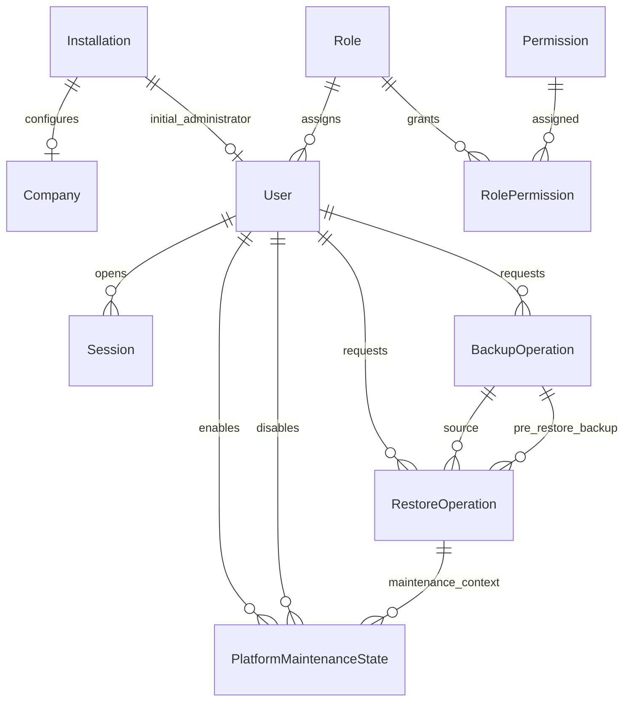

# Modelo fisico de datos: Fase 0 - Plataforma

## 1. Proposito

Este documento traduce el modelo de dominio de Plataforma a un diseno fisico inicial para PostgreSQL gestionado con Prisma.

## 2. Plataforma de persistencia

- Motor: PostgreSQL.
- ORM y migraciones: Prisma.
- Modelo: `prisma/schema.prisma`.
- Identificadores: `uuid`.
- Marcas temporales: `timestamptz`.
- JSON: `jsonb`.
- Booleanos: `boolean`.
- Hashes SHA-256 y HMAC: `bytea` o texto codificado segun adaptador.

## 3. Convenciones

- Tablas en `snake_case`.
- Modelos Prisma en PascalCase.
- Campos TypeScript/Prisma en camelCase.
- Indices unicos para claves funcionales.
- Borrado fisico restringido en datos auditables.
- `createdAt` y `updatedAt` cuando aplique.

## 4. Tablas iniciales

| Area | Tabla Prisma/PostgreSQL | Proposito |
|---|---|---|
| Inicializacion | `Installation` / `installations` | Estado singleton de instalacion |
| Configuracion | `Company` / `companies` | Empresa inicial |
| Identidad | `User` / `users` | Primer administrador y usuarios posteriores |
| Identidad | `ReservedUserName` / `reserved_user_names` | Nombres de usuario no reutilizables |
| Identidad | `Session` / `sessions` | Sesiones web activas, caducadas o revocadas |
| Identidad | `LoginAttempt` / `login_attempts` | Intentos de acceso y bloqueo |
| Seguridad | `RateLimitBucket` / `rate_limit_buckets` | Contadores atomicos por ventana para limites de peticiones |
| Autorizacion | `Role` / `roles` | Roles base |
| Autorizacion | `Permission` / `permissions` | Permisos funcionales |
| Autorizacion | `RolePermission` / `role_permissions` | Relacion rol-permiso |
| Auditoria | `AuditEvent` / `audit_events` | Eventos auditables |
| Idempotencia | `IdempotencyRecord` / `idempotency_records` | Repeticion segura de mutaciones iniciales |
| Copias | `BackupOperation` / `backup_operations` | Estado y metadatos de copias manuales |
| Copias | `RestoreOperation` / `restore_operations` | Solicitudes y trazabilidad de restauraciones |
| Operacion | `PlatformMaintenanceState` / `platform_maintenance_state` | Estado singleton de mantenimiento operativo |

## 5. Diagrama logico



## 6. Modelo Prisma inicial

El modelo fisico vigente esta en `prisma/schema.prisma`.

Entidades iniciales:

- `Installation`.
- `Company`.
- `User`.
- `Role`.
- `Permission`.
- `RolePermission`.
- `AuditEvent`.
- `ReservedUserName`.
- `Session`.
- `LoginAttempt`.
- `RateLimitBucket`.
- `IdempotencyRecord`.
- `BackupOperation`.
- `RestoreOperation`.
- `PlatformMaintenanceState`.

## 7. Restricciones clave

- `Installation.singletonKey` es unico para garantizar una unica instalacion.
- `Company.taxId` es unico.
- `User.userName` es unico.
- `User.normalizedUserName` es unico.
- `ReservedUserName.normalizedUserName` es unico.
- `Role.code` es unico.
- `Permission.code` es unico.
- `RolePermission` usa clave compuesta `roleId + permissionId`.
- `Session.tokenHash` es unico.
- `RateLimitBucket.key` es unico.
- `IdempotencyRecord.key` es unico.
- La migracion `20260701193000_add_active_session_unique_index` crea el indice unico parcial `sessions_one_active_per_user_idx` sobre `sessions("userId")` cuando `"revokedAt" IS NULL`. Prisma no expresa este indice en `schema.prisma`, por lo que se mantiene como SQL manual.
- `BackupOperation` indexa `status + requestedAt`, `requestedAt + id` y `requestedById + requestedAt` para consultas operativas paginadas.
- La migracion `20260702171000_add_active_backup_operation_index` crea el indice unico parcial `backup_operations_one_active_idx` para impedir mas de una copia `REQUESTED` o `RUNNING`.
- `BackupOperation.storageKey` guarda solo el nombre logico del artefacto dentro del repositorio de copias, no una ruta absoluta expuesta por API.
- `RestoreOperation` indexa `status + requestedAt`, `requestedAt + id`, `backupOperationId + requestedAt` y `requestedById + requestedAt`.
- La migracion `20260702203000_add_restore_operations` crea el indice unico parcial `restore_operations_one_active_idx` para impedir mas de una restauracion activa.
- La migracion `20260702210000_add_restore_validation_state` incorpora `VALIDATED` y `validatedAt` para registrar la validacion no destructiva del artefacto cifrado.
- Las solicitudes HTTP de copia y restauracion toman un advisory lock transaccional de PostgreSQL antes de comprobar operaciones activas, para serializar la exclusion entre `backup_operations` y `restore_operations`.
- `PlatformMaintenanceState.singletonKey` es unico y la migracion `20260702214500_harden_platform_maintenance` refuerza por SQL que solo pueda valer `1`.
- Si `PlatformMaintenanceState.enabled = true`, la base exige `mode`, `enabledAt` y `enabledById`.
- Para `mode = RESTORE`, la base exige `restoreOperationId`.

## 8. Copias de seguridad

El proceso de copia manual se divide en dos pasos:

1. La API registra `BackupOperation` en estado `REQUESTED`.
2. El worker `npm run backup:run` procesa la siguiente solicitud.

El worker:

- Marca la operacion como `RUNNING` antes de hacer I/O.
- Ejecuta `pg_dump` sin shell y sin aceptar argumentos del cliente.
- Pasa la contrasena de PostgreSQL por `PGPASSWORD`, no como argumento de proceso.
- Pasa a `pg_dump` un entorno minimo para evitar propagar otros secretos de aplicacion.
- Cifra el volcado con AES-256-GCM y autentica el encabezado del artefacto como AAD.
- Guarda un artefacto `.backup` en `BACKUP_DIRECTORY`.
- Reabre el artefacto cifrado y valida el tag de autenticacion AES-GCM antes de considerarlo verificado a nivel de integridad criptografica.
- Calcula `sha256` del artefacto cifrado y registra `sizeBytes`.
- Marca la operacion como `VERIFIED` o `FAILED`.
- Marca como `FAILED` las operaciones `RUNNING` que exceden `BACKUP_RUNNING_TIMEOUT_MINUTES`.
- Audita `BACKUP_VERIFIED` o `BACKUP_FAILED` sin rutas absolutas ni secretos.

La verificacion de restaurabilidad completa, incluyendo `pg_restore --list` o restauracion controlada, pertenece al flujo de restauracion.

## 9. Restauraciones

El primer tramo del flujo de restauracion registra solicitudes seguras y permite validar el artefacto cifrado sin ejecutar todavia `pg_restore`.

La API:

- Registra `RestoreOperation` en estado `REQUESTED`.
- Exige una copia `VERIFIED` de la misma `productVersion`.
- Rechaza copias sin `storageKey`, `sizeBytes` o `sha256`.
- Impide restauraciones si existe una copia `REQUESTED` o `RUNNING`.
- Impide nuevas copias si existe una restauracion activa.
- No expone `storageKey` ni rutas fisicas en el contrato HTTP.
- Audita `RESTORE_REQUESTED` y `RESTORE_OPERATIONS_VIEWED`.

El comando `npm run restore:validate` procesa la siguiente restauracion `REQUESTED`:

1. Marca la operacion como `VALIDATING`.
2. Audita `RESTORE_VALIDATION_STARTED`.
3. Resuelve `storageKey` exclusivamente dentro de `BACKUP_DIRECTORY`.
4. Compara `sizeBytes` y `sha256` del artefacto cifrado con los metadatos de `BackupOperation`.
5. Reabre el artefacto cifrado y valida el tag AES-256-GCM.
6. Marca `VALIDATED` y registra `validatedAt`, o marca `FAILED` con `errorCode`.
7. Audita `RESTORE_VALIDATED` o `RESTORE_VALIDATION_FAILED` sin rutas absolutas ni secretos.

`VALIDATED` representa solo validacion no destructiva del artefacto. No ejecuta restauracion, no invalida sesiones y no se considera una operacion activa a efectos de bloquear nuevas copias.

Los estados `PREPARING`, `RESTORING`, `VERIFYING`, `COMPLETED` y `REQUIRES_RECOVERY` quedan reservados para el procedimiento de restauracion controlada.

## 10. Modo mantenimiento

El modo mantenimiento se activa antes de una restauracion destructiva real.

Reglas:

- Requiere permiso `Platform.ManageMaintenance`.
- Solo puede activarse para una `RestoreOperation` en estado `VALIDATED`.
- Audita `MAINTENANCE_MODE_ENABLED` y `MAINTENANCE_MODE_DISABLED`.
- Bloquea mutaciones normales con `423 MAINTENANCE_MODE_ACTIVE` y audita `MAINTENANCE_MUTATION_BLOCKED`.
- Mantiene permitidas rutas operativas necesarias para evitar lockout: health, sesion/CSRF/login/logout, consulta de auditoria, lectura de copias/restauraciones y `GET/PATCH /api/platform/maintenance`.
- No ejecuta `pg_restore`; solo prepara la exclusividad previa.

## 11. Modelo de accesos

Las sesiones usan token opaco en cookie segura. La base solo conserva `tokenHash`.

Reglas:

- Una sesion revocada no puede volver a usarse.
- La expiracion se valida en servidor.
- El login revoca sesiones expiradas no revocadas antes de crear una nueva sesion, con motivo `SESSION_EXPIRED`.
- La version de seguridad de la sesion debe coincidir con la del usuario.
- El cambio de contrasena, rol, permisos, bloqueo o desactivacion revoca sesiones.
- Los intentos de login se registran sin guardar la contrasena.
- El bloqueo por intentos fallidos se apoya en `failedLoginCount`, `lockedUntil` y `login_attempts`.
- El rate limit de login usa `rate_limit_buckets` con actualizacion atomica por ventana cuando existe IP cliente confiable.
- Las cabeceras de proxy para IP cliente solo se usan si `TRUST_PROXY_HEADERS=true` o fuera de produccion; en produccion sin proxy confiable no se aplica el bucket por IP para evitar un limite global compartido.

## 12. Transacciones

La inicializacion de Plataforma se ejecuta con `prisma.$transaction`.

Debe crear o confirmar en una unica transaccion:

1. Empresa.
2. Primer administrador.
3. Instalacion.
4. Registro de idempotencia.
5. Evento de auditoria.

Si cualquier paso falla, no debe quedar estado parcial.

## 13. Auditoria

`AuditEvent` es append-only a nivel de aplicacion.

Reglas:

- No guardar contrasenas ni secretos.
- Guardar tipo de evento estable.
- Guardar actor tecnico o usuario.
- Guardar payload JSON minimo.
- Indexar `createdAt` e `eventType` para consulta paginada del visor de auditoria.

## 14. Migraciones

Desarrollo:

```powershell
npm run prisma:migrate
```

Produccion:

```powershell
npm run prisma:deploy
```

Reglas:

1. No editar migraciones ya aplicadas.
2. No incluir secretos.
3. Revisar cambios destructivos por etapas.
4. Validar contra PostgreSQL real.

## 15. Criterios de aceptacion

1. Prisma genera cliente.
2. La migracion crea todas las tablas iniciales.
3. Las restricciones evitan duplicados funcionales.
4. La inicializacion es transaccional.
5. La auditoria no contiene secretos.
