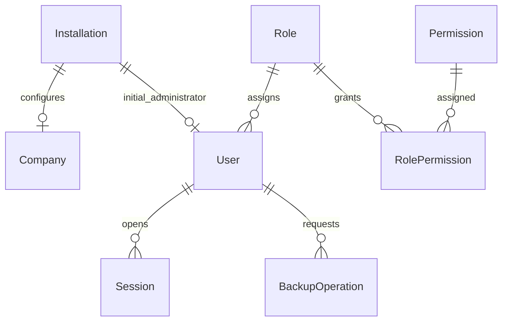

# Modelo fisico de datos: Fase 0 - Plataforma

## 1. Proposito

Este documento traduce el modelo de dominio de Plataforma a un diseno fisico inicial para PostgreSQL gestionado con Prisma.

## 2. Plataforma de persistencia

- Motor: PostgreSQL.
- ORM y migraciones: Prisma.
- Modelo: `prisma/schema.prisma`.
- Identificadores: `uuid`.
- Marcas temporales: `timestamptz`.
- JSON: `jsonb`.
- Booleanos: `boolean`.
- Hashes SHA-256 y HMAC: `bytea` o texto codificado segun adaptador.

## 3. Convenciones

- Tablas en `snake_case`.
- Modelos Prisma en PascalCase.
- Campos TypeScript/Prisma en camelCase.
- Indices unicos para claves funcionales.
- Borrado fisico restringido en datos auditables.
- `createdAt` y `updatedAt` cuando aplique.

## 4. Tablas iniciales

| Area | Tabla Prisma/PostgreSQL | Proposito |
|---|---|---|
| Inicializacion | `Installation` / `installations` | Estado singleton de instalacion |
| Configuracion | `Company` / `companies` | Empresa inicial |
| Identidad | `User` / `users` | Primer administrador y usuarios posteriores |
| Identidad | `ReservedUserName` / `reserved_user_names` | Nombres de usuario no reutilizables |
| Identidad | `Session` / `sessions` | Sesiones web activas, caducadas o revocadas |
| Identidad | `LoginAttempt` / `login_attempts` | Intentos de acceso y bloqueo |
| Seguridad | `RateLimitBucket` / `rate_limit_buckets` | Contadores atomicos por ventana para limites de peticiones |
| Autorizacion | `Role` / `roles` | Roles base |
| Autorizacion | `Permission` / `permissions` | Permisos funcionales |
| Autorizacion | `RolePermission` / `role_permissions` | Relacion rol-permiso |
| Auditoria | `AuditEvent` / `audit_events` | Eventos auditables |
| Idempotencia | `IdempotencyRecord` / `idempotency_records` | Repeticion segura de mutaciones iniciales |
| Copias | `BackupOperation` / `backup_operations` | Estado y metadatos de copias manuales |

## 5. Diagrama logico



## 6. Modelo Prisma inicial

El modelo fisico vigente esta en `prisma/schema.prisma`.

Entidades iniciales:

- `Installation`.
- `Company`.
- `User`.
- `Role`.
- `Permission`.
- `RolePermission`.
- `AuditEvent`.
- `ReservedUserName`.
- `Session`.
- `LoginAttempt`.
- `RateLimitBucket`.
- `IdempotencyRecord`.
- `BackupOperation`.

## 7. Restricciones clave

- `Installation.singletonKey` es unico para garantizar una unica instalacion.
- `Company.taxId` es unico.
- `User.userName` es unico.
- `User.normalizedUserName` es unico.
- `ReservedUserName.normalizedUserName` es unico.
- `Role.code` es unico.
- `Permission.code` es unico.
- `RolePermission` usa clave compuesta `roleId + permissionId`.
- `Session.tokenHash` es unico.
- `RateLimitBucket.key` es unico.
- `IdempotencyRecord.key` es unico.
- La migracion `20260701193000_add_active_session_unique_index` crea el indice unico parcial `sessions_one_active_per_user_idx` sobre `sessions("userId")` cuando `"revokedAt" IS NULL`. Prisma no expresa este indice en `schema.prisma`, por lo que se mantiene como SQL manual.
- `BackupOperation` indexa `status + requestedAt`, `requestedAt + id` y `requestedById + requestedAt` para consultas operativas paginadas.
- La migracion `20260702171000_add_active_backup_operation_index` crea el indice unico parcial `backup_operations_one_active_idx` para impedir mas de una copia `REQUESTED` o `RUNNING`.

## 8. Modelo de accesos

Las sesiones usan token opaco en cookie segura. La base solo conserva `tokenHash`.

Reglas:

- Una sesion revocada no puede volver a usarse.
- La expiracion se valida en servidor.
- El login revoca sesiones expiradas no revocadas antes de crear una nueva sesion, con motivo `SESSION_EXPIRED`.
- La version de seguridad de la sesion debe coincidir con la del usuario.
- El cambio de contrasena, rol, permisos, bloqueo o desactivacion revoca sesiones.
- Los intentos de login se registran sin guardar la contrasena.
- El bloqueo por intentos fallidos se apoya en `failedLoginCount`, `lockedUntil` y `login_attempts`.
- El rate limit de login usa `rate_limit_buckets` con actualizacion atomica por ventana cuando existe IP cliente confiable.
- Las cabeceras de proxy para IP cliente solo se usan si `TRUST_PROXY_HEADERS=true` o fuera de produccion; en produccion sin proxy confiable no se aplica el bucket por IP para evitar un limite global compartido.

## 9. Transacciones

La inicializacion de Plataforma se ejecuta con `prisma.$transaction`.

Debe crear o confirmar en una unica transaccion:

1. Empresa.
2. Primer administrador.
3. Instalacion.
4. Registro de idempotencia.
5. Evento de auditoria.

Si cualquier paso falla, no debe quedar estado parcial.

## 10. Auditoria

`AuditEvent` es append-only a nivel de aplicacion.

Reglas:

- No guardar contrasenas ni secretos.
- Guardar tipo de evento estable.
- Guardar actor tecnico o usuario.
- Guardar payload JSON minimo.
- Indexar `createdAt` e `eventType` para consulta paginada del visor de auditoria.

## 11. Migraciones

Desarrollo:

```powershell
npm run prisma:migrate
```

Produccion:

```powershell
npm run prisma:deploy
```

Reglas:

1. No editar migraciones ya aplicadas.
2. No incluir secretos.
3. Revisar cambios destructivos por etapas.
4. Validar contra PostgreSQL real.

## 12. Criterios de aceptacion

1. Prisma genera cliente.
2. La migracion crea todas las tablas iniciales.
3. Las restricciones evitan duplicados funcionales.
4. La inicializacion es transaccional.
5. La auditoria no contiene secretos.
